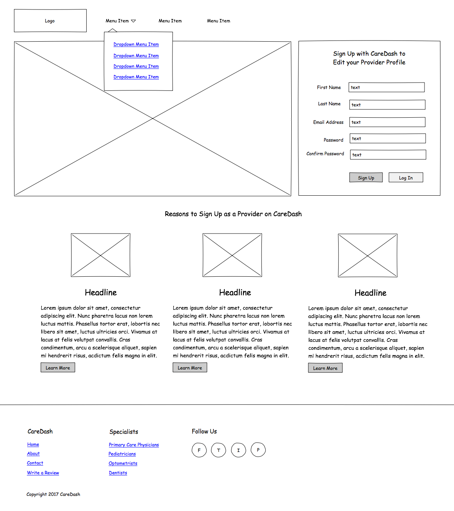
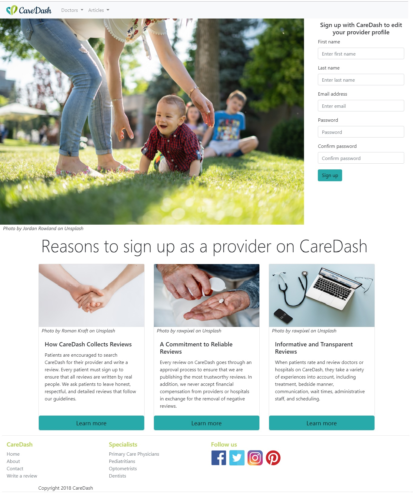

# CareDash

Creation of a CareDash landing page as per the wireframe provided.
This project was generated with [Angular CLI](https://github.com/angular/angular-cli) and uses Bootstrap.

## Instructions
Run `npm install` and then `ng serve` for a dev server. Navigate to `http://localhost:4200/`. The app will automatically reload if you change any of the source files.

## Wireframe

## Screenshot of the final result:

